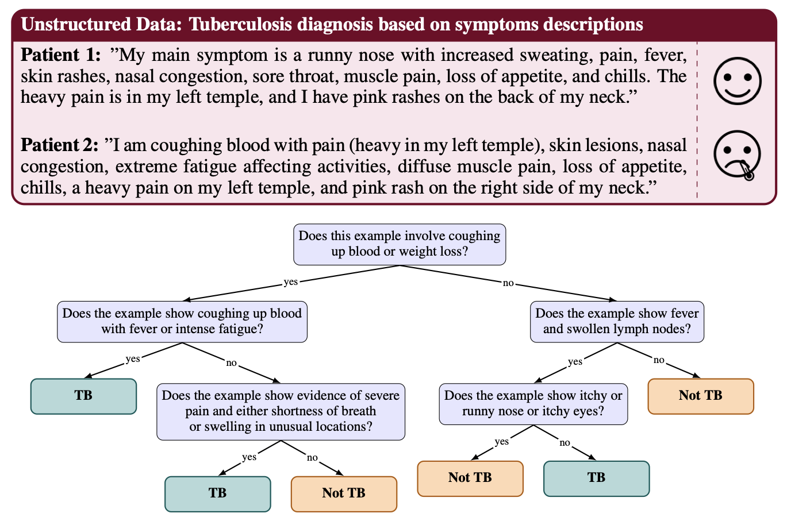

# ACT: Agentic Classification Tree 


**Example ACT decision tree for tuberculosis diagnosis using unstructured, free-text patient descriptions.** _A tree is automatically learned, with each node containing a binary natural language question, autonomously discovered via recursive prompt refinement to maximize label separation at each split. At inference, these questions are answered by a large language model (LLM) from the root node to the leaves of the tree. The final classification (TB or Not TB) corresponds to the majority label of training examples described by each leaf._

<!--- BADGES: START --->
[](https://arxiv.org/abs/2509.26433)
[](https://www.python.org/downloads/)
<!--- BADGES: END --->

⚠️ ***Demo Release**: This repository provides a lightweight demonstration of ACT.
A full-featured version with all experiments and utilities is under preparation for open release.

## Interpretable Agentic LLM-Based Decision Trees for Unstructured Data

ACT (Agentic Classification Tree) extends traditional decision tree methodology to unstructured inputs like text by formulating each split as a natural-language question. Unlike black-box LLM approaches, ACT provides **fully traceable and auditable decision paths** while matching or surpassing prompting-based baselines.

### Key Features

- 🌳 **Interpretable**: Each decision node contains a human-readable natural language question
- 🎯 **Optimized**: Questions are automatically refined via TextGrad to minimize impurity
- 🔍 **Transparent**: Full decision paths from root to leaf are easily auditable
- 🚀 **Effective**: Matches or exceeds CoT, DSPy, and TextGrad baselines across benchmarks

### Example: Tuberculosis Diagnosis

**Unstructured Data Input:**
```
Patient 1: "My main symptom is a runny nose with increased sweating, pain, fever,
skin rashes, nasal congestion, sore throat, muscle pain, loss of appetite, and chills."
→ Classification: Not TB

Patient 2: "I am coughing blood with pain, skin lesions, nasal congestion, extreme 
fatigue, diffuse muscle pain, loss of appetite, chills, and pink rash on my neck."
→ Classification: TB
```

The ACT model iteratively learns questions like these for each node:
- *"Does this example involve coughing up blood or weight loss?"*
- *"Does the example show fever and swollen lymph nodes?"*

---

## Demo Notebooks

We provide for each dataset used in the paper a comprehensive Jupyter notebook for interactive exploration:
```bash
notebooks/act_demo_diagno.ipynb # In Jupyter, select the 'act' kernel (Kernel → Change kernel)
notebooks/act_demo_jailbreak.ipynb # In Jupyter, select the 'act' kernel (Kernel → Change kernel)
notebooks/act_demo_spam.ipynb # In Jupyter, select the 'act' kernel (Kernel → Change kernel)
```

The notebook includes:
- ✅ Step-by-step tutorial with explanations
- ✅ Sample data exploration
- ✅ Model training with different hyperparameters
- ✅ Evaluation and metrics
- ✅ Tree visualization

See below for instructions on how to correctly set up the environment and notebook kernel.

---


## Setup

### 1. Clone repository and create conda environment
```bash
# Clone the repository
git clone https://github.com/axa-rev-research/ACT
cd ACT

# Activate conda env
conda env create -f environment.yml
conda activate act

# Make local 'src/' and 'textgrad/' imports work without packaging
export PYTHONPATH="$PWD/src:$PWD/textgrad:$PYTHONPATH"
```

### 2. Setup API Credentials

Create a `.env` file in the project root and add API keys based on your needs:
```bash
# For OpenAI
OPENAI_API_KEY=your-api-key-here

# OR for Azure OpenAI
AZURE_OPENAI_ENDPOINT=https://your-endpoint.openai.azure.com/
AZURE_OPENAI_API_KEY=your-azure-key
OPENAI_API_VERSION=2024-02-15-preview
OPENAI_MODEL_NAME=your-deployment-name
PROVIDER=azure
```

### 3. Load and Prepare Data
```python
import textgrad as tg # Make sure to use the local textgrad version
from textgrad.tasks import load_task

# Setup engine
llm_engine = tg.get_engine("gpt-4.1-mini")  # or "azure-your-deployment" or "vllm-your_model_name" or "ollama-your_model_name"
tg.set_backward_engine(llm_engine, override=True)

# Load dataset (e.g., tuberculosis diagnosis)
train_set, val_set, test_set, eval_fn = load_task(
    "DIAGNO",  # or "SPAM", "JAILBREAK"
    evaluation_api=llm_engine
)

# Convert labels to yes/no format
train_set = [(x, "yes" if y == 1 else "no") for x, y in train_set]
test_set = [(x, "yes" if y == 1 else "no") for x, y in test_set]

print(f"Train: {len(train_set)}, Test: {len(test_set)}")
```

### 4. Train ACT Model
```python
import src.helper_functions as fn

# Initialize the model
model = fn.CARTAgent(llm_engine, max_depth=3)

# Extract data and labels
train_data = [x for x, _ in train_set]
train_labels = [y for _, y in train_set]

# Train the tree
model.fit(
    train_data=train_data,
    train_labels=train_labels,
    llm_engine=llm_engine,
    max_steps_per_node=10,      # Optimization steps per node
    max_depth=3,                # Maximum tree depth
    max_workers=16,             # Parallel threads
    max_logical_ops=1,          # Max 'and'/'or' in questions
    max_examples_per_group=50,  # Examples for feedback
    keyword="characteristic",   # Focus keyword (task-specific)
    data_type="a text"          # Data type description (task-specific)
)

```

### 5. Evaluate Performance
```python
# Evaluate on test set
test_acc = fn.eval_dataset(
    test_set, 
    eval_fn, 
    model, 
    max_workers=16,             # Parallel threads
    keyword="characteristic",   # Focus keyword (task-specific), use same here if used during training
    data_type="a text"          # Data type description (task-specific), use same here if used during training
)

print(f"Test Accuracy: {np.mean(test_acc):.2%}")
```

### 5. Visualize Decision Tree
```python
import numpy as np

# Generate and save tree visualization
fn.visualize_acart_tree(
    root=model.root,
    data=train_data,
    labels=train_labels,
    llm_engine=llm_engine,
    max_workers=4,
    keyword="characteristics",
    data_type="a text",
    save_path="mytask_tree.png"
)
```


### Key Arguments

| Argument | Description | Default |
|----------|-------------|---------|
| `--task` | Dataset name (DIAGNO3, SPAM, Jailbreak) | DIAGNO3 |
| `--max_depth` | Maximum tree depth | 3 |
| `--max_steps_per_node` | Optimization steps per node | 3 |
| `--num_threads` | Parallel workers | 16 |
| `--max_logical_ops` | Max 'and'/'or' operators in questions | 1 |
| `--max_examples_per_group` | Number of examples shown per group at each refinement step | 50 |
| `--keyword` | Task-specific focus keyword | "characteristic" |
| `--data_type` | Description of input data type | "a text" |
| `--min_gini` | Gini stopping criteria | 0.05 |

---

## Project Structure
```
ACT-tree/
│
├── src/
│   ├── functions.py          # Core ACT implementation
│   ├── function_prompts.py   # Prompt templates
│   └── helper_demo.py        # Helper functions for demos
│
├── notebooks/
│   └── act_demo_*.ipynb      # Interactive tutorial notebooks
│
├── textgrad/                 # TextGrad submodule/dependency
│
├── environment.yml           # Conda env file
├── .env                      # Add your environment variables (e.g. API keys) here
└── README.md                 # This file
```

---

## How ACT Works

### 1. Node Definition
Each internal node contains a **natural language question** (e.g., *"Does the text mention coughing up blood?"*). The LLM evaluates this question for each input and routes it left (yes) or right (no).

### 2. Split Optimization
ACT uses **TextGrad** to iteratively refine questions by:
- Evaluating weighted Gini impurity for the current split
- Analyzing misclassified vs. correctly classified examples via LLM feedback
- Generating actionable suggestions to improve the question
- Updating the prompt to minimize impurity

### 3. Tree Construction
The tree is built **recursively** from root:
- Start with a generic question at each node
- Optimize the question through multiple refinement steps
- Split data based on LLM responses
- Recursively build left and right subtrees
- Stop when perfect purity is achieved, min gini or depth limit is reached

### 4. Prediction
At inference time:
- Start at the root node
- Query the LLM with the node's question on the input
- Follow the yes/no branch based on the response
- Repeat until reaching a leaf node
- Return the leaf's majority class label

---

## Contact

For questions or issues, please:
- Open an issue on GitHub or
- Contact the authors: vincent.grari@axa.com, tim.arni@epfl.ch

---

## Related Projects

- [TextGrad](https://github.com/zou-group/TextGrad) - Automatic differentiation via text
- [DSPy](https://github.com/stanfordnlp/dspy) - Programming with language models
- [scikit-learn Decision Trees](https://scikit-learn.org/stable/modules/tree.html) - Traditional decision trees for tabular data