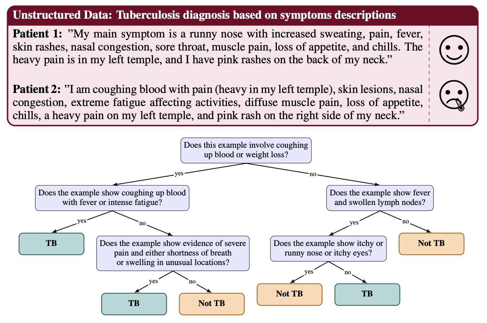

# ACT: Agentic Classification Tree 


**Example ACT decision tree for tuberculosis (TB) diagnosis using unstructured, free-text patient descriptions.** _A tree is automatically learned, with each node containing a binary natural language question, autonomously discovered via recursive prompt refinement to maximize label separation at each split. At inference, these questions are answered by a large language model (LLM) from the root node to the leaves of the tree. The final classification (TB or Not TB) corresponds to the majority label of training examples described by each leaf._

<!--- BADGES: START --->
[](https://arxiv.org/abs/2509.26433)
[](https://www.python.org/downloads/)
<!--- BADGES: END --->

## Interpretable Agentic LLM-Based Decision Trees for Unstructured Data

ACT (Agentic Classification Tree) extends traditional decision tree methodology to unstructured inputs like text by formulating each split as a natural-language question. Unlike black-box LLM approaches, ACT provides **fully traceable and auditable decision paths** while matching or surpassing prompting-based baselines.

### Key Features

- 🌳 **Interpretable**: Each decision node contains a human-readable natural language question
- 🎯 **Optimized**: Questions are automatically refined via TextGrad to minimize impurity
- 🔍 **Transparent**: Full decision paths from root to leaf are easily auditable
- 🚀 **Effective**: Matches or exceeds CoT, DSPy and TextGrad baselines across benchmarks

### Example: Tuberculosis Diagnosis
```
Patient 1: "My main symptom is a runny nose with increased sweating, pain, fever,
skin rashes, nasal congestion, sore throat, muscle pain, loss of appetite, and chills."
→ Classification: Not TB

Patient 2: "I am coughing blood with pain, skin lesions, nasal congestion, extreme
fatigue, diffuse muscle pain, loss of appetite, chills, and pink rash on my neck."
→ Classification: TB
```

The ACT model iteratively learns questions like these for each node:
- *"Does this example involve coughing up blood or weight loss?"*
- *"Does the example show fever and swollen lymph nodes?"*

---

## Demo Notebooks

Interactive Jupyter notebooks are provided for three dataset used in the paper:
```
notebooks/act_demo_diagno.ipynb      # Tuberculosis diagnosis
notebooks/act_demo_spam.ipynb        # Spam detection
notebooks/act_demo_jailbreak.ipynb   # Jailbreak prompt detection
```

Each notebook includes step-by-step data exploration, model training, evaluation and tree visualization. See the [Setup](#setup) section below for environment and kernel instructions.

---

## Project Structure
```
ACT/
│
├── act_output/               # Create this folder to store created trees (.pkl) and training metadata
├── act_src/
│   ├── act.py                # Main training and evaluation script
│   ├── eval_act.py           # Evaluate a saved ACT model
│   ├── vis_act.py            # Visualize a saved ACT model
│   ├── functions.py          # Core ACT implementation
│   ├── function_prompts.py   # Prompt templates
│   ├── demo_helper.py        # Functions needed for demo notebooks
│   └── act_helper.py         # Helper functions
│
├── notebooks/                # Contains demo notebooks
├── output/                   # Contains output from demo notebooks
├── textgrad/                 # TextGrad submodule/dependency
│   ├── tasks/                # Data loading handled here, add new datasets/tasks here
│
├── environment.yml           # Conda env for API-hosted models (e.g. Azure)
├── vllm_env.yml              # Conda env for self-hosted models via vLLM
├── .env                      # API credentials (create this yourself)
└── README.md
```

---

## Setup

### 1. Clone the Repository
```bash
git clone https://github.com/axa-rev-research/ACT
cd ACT
```

### 2. Choose and Create the Right Conda Environment

There are **two conda environments** depending on how you serve your LLM:

| Environment | File | Use when |
|---|---|---|
| `act` | `environment.yml` | Using an API-hosted model (e.g. Azure OpenAI) |
| `act_vllm` | `vllm_env.yml` | Self-hosting a model locally via vLLM |
```bash
# For API-hosted models (Azure, OpenAI):
conda env create -f environment.yml
conda activate act

# For self-hosted models via vLLM:
conda env create -f vllm_env.yml
conda activate act_vllm
```

### 3. Set the Python Path

This step is required when running `act.py` from the command line, so that the code uses the local textgrad version:
```bash
export PYTHONPATH="$PWD/act_src:$PWD/textgrad:$PYTHONPATH"
```

> **Note:** The demo notebooks handle path setup automatically via `demo_helper.py` — no manual `PYTHONPATH` export is needed when using notebooks.

### 4. Register the Jupyter Kernel (for notebooks)

To use the demo notebooks, register the conda environment as a Jupyter kernel:
```bash
conda activate act
python -m ipykernel install --user --name act --display-name "ACT"
```
Then in Jupyter, select the **ACT** kernel (Kernel → Change kernel).

### 5. Set Up API Credentials

Create a `.env` file in the project root. The demo notebooks load this file automatically via `python-dotenv`.
```bash
# For Azure OpenAI
AZURE_OPENAI_ENDPOINT=https://your-endpoint.openai.azure.com/
AZURE_OPENAI_API_KEY=your-azure-key
OPENAI_API_VERSION=2024-02-15-preview
OPENAI_MODEL_NAME=your-deployment-name
AZURE_API_BASE=${AZURE_OPENAI_ENDPOINT} # LiteLLM compatibility
AZURE_API_VERSION=${OPENAI_API_VERSION} # LiteLLM compatibility
AZURE_API_KEY=${AZURE_OPENAI_API_KEY} # LiteLLM compatibility

# For OpenAI directly
OPENAI_API_KEY=your-api-key-here

# Huggingface (optional)
HF_TOKEN=your-hf-token
```

If using vLLM, no `.env` credentials are needed — see the vLLM section below.

---

## Running ACT: Azure-Hosted Model

Activate the standard environment and set the path:
```bash
conda activate act
export PYTHONPATH="$PWD/act_src:$PWD/textgrad:$PYTHONPATH"
mkdir -p act_output  # create the output directory if it doesn't exist
```

Run training with `act.py`:
```bash
python -u act_src/act.py \
  --task DIAGNO \
  --model azure-gpt-4.1-nano \
  --max_depth 4 \
  --max_steps_per_node 10 \
  --num_threads 16 \
  --out_dir ./act_output \
  2>&1 | tee -a act_output/diagno_act_4_10_nano_1.out
```

---

## Running ACT: Self-Hosted Model via vLLM

Running with vLLM requires two separate processes: the **vLLM server** and the **ACT training script**. We recommend using `tmux` to manage both in the background, especially on a remote machine.

### Step 1 — Start the vLLM Server

Create a tmux session for the server:
```bash
conda activate act_vllm
cd ACT
tmux new -s vllm_server
```

Inside the tmux session, configure your environment and launch the server:
```bash
conda activate act_vllm
cd ACT

# Set Python path
export PYTHONPATH="$PWD/act_src:$PWD/textgrad:$PYTHONPATH"

# Optional but recommended: configure caches and disable torch compile
export HF_HOME=~/.cache/huggingface
export TOKENIZERS_PARALLELISM=false
export VLLM_TORCH_COMPILE_BACKEND=none
export TORCHDYNAMO_DISABLE=1

# Select GPU (check yours with nvidia-smi)
export CUDA_VISIBLE_DEVICES=0   # adjust to your target GPU index

# Server address
export HOST=0.0.0.0
export PORT=8000

# Create log directory and launch server
mkdir -p logs
python -u -m vllm.entrypoints.openai.api_server \
  --model google/gemma-3-4b-it \
  --host $HOST \
  --port $PORT \
  --dtype bfloat16 \
  --tensor-parallel-size 1 \
  --max-model-len 40960 \
  --gpu-memory-utilization 0.92 \
  --max-num-seqs 256 \
  --max-num-batched-tokens 65536 \
  --enforce-eager \
  --trust-remote-code \
  2>&1 | tee -a logs/vllm_server.out
```

Detach from the tmux session once the server is ready: **`Ctrl-b` then `d`**

### Step 2 — Verify the Server is Running

In a new shell, run a quick smoke test:
```bash
curl http://localhost:8000/v1/models
```

This returns the model ID you will need for the `--model` argument in Step 3.

### Step 3 — Run ACT Against the vLLM Server

Open a new tmux session for training:
```bash
tmux new -s acart
conda activate act_vllm
cd ACT

export PYTHONPATH="$PWD/act_src:$PWD/textgrad:$PYTHONPATH"
export OPENAI_BASE_URL=http://localhost:8000/v1
export OPENAI_API_KEY=dummy_key   # required by the OpenAI client, but not validated by vLLM
```

Run training using the model ID returned by the smoke test (`MODEL_ID_FROM_CURL`):
```bash
python -u act_src/act.py \
  --task SPAM \
  --model openai-google/gemma-3-4b-it \
  --max_depth 3 \
  --max_steps_per_node 10 \
  --num_threads 32 \
  --out_dir ./act_output \
  2>&1 | tee -a act_output/spam_act_3_10_gemma_1.out
```

Detach from the session once training starts: **`Ctrl-b` then `d`**

---

## Evaluating a Saved Model
```bash
python -u act_src/eval_act.py \
  --model_path ./act_output/DIAGNO_FULL_azure_gpt_4_1_nano_depth4_steps10_acc0.8500.pkl \
  --num_threads 16
```

Add `--do_full_test_set` to additionally evaluate on the full (unbalanced) test set if available.

---

## Visualizing a Saved Model
```bash
python -u act_src/vis_act.py \
  --model_path ./act_output/DIAGNO_FULL_azure_gpt_4_1_nano_depth4_steps10_acc0.8500.pkl
```

The visualization is saved as a `.png` in the same directory as the model file.

---

## Key Arguments

| Argument | Description | Default |
|---|---|---|
| `--task` | Dataset name (`DIAGNO3`, `DIAGNO_FULL`, `SPAM`, `SPAM_FULL_DATASET`, `JAILBREAK`, `BANKCHURN`, `BANKCHURN_IMBALANCED`, `BANKCHURN_FULL`, `IMDBBALANCED`, `IMDBFULL`) | `DIAGNO3` |
| `--model` | Model string (e.g. `azure-gpt-4.1-nano`, `openai-google/gemma-3-4b-it`) | `azure-gpt-4.1-nano` |
| `--max_depth` | Maximum tree depth | `3` |
| `--max_steps_per_node` | Optimization steps per node | `3` |
| `--num_threads` | Parallel workers | `16` |
| `--max_logical_ops` | Max `and`/`or` operators in questions | `2` |
| `--max_examples_per_group` | Examples shown per group at each refinement step | `50` |
| `--keyword` | Task-specific focus keyword | `characteristic` |
| `--data_type` | Description of input data type | `a text` |
| `--min_gini` | Gini stopping threshold | `0.01` |
| `--stop_min_samples` | Min samples required to continue splitting a node | `10` |
| `--train_pct` | Percentage of training set to use (1–100) | `100.0` |
| `--optimization_constraints` | Constraint mode (`basic`, `exploring`, `exploiting`) | `exploring` |
| `--do_two_stage_training` | Enable exploring → exploiting stage switch | off |
| `--eval_full_test_set` | Also evaluate on full unbalanced test set | off |
| `--out_dir` | Output directory for logs, weights, and visualizations | `./act_output` |
| `--checkpoint_dir` | Directory to save training checkpoints | `act_train_chckpts` |
| `--no_save_model` | Disable saving the final `.pkl` model | off |
| `--do_vis` | Generate tree visualization after training | off |

---

## How ACT Works

### 1. Node Definition
Each internal node contains a **natural language question** (e.g., *"Does the text mention coughing up blood?"*). The LLM evaluates this question for each input and routes it left (yes) or right (no).

### 2. Split Optimization
ACT uses **TextGrad** to iteratively refine questions by:
- Evaluating weighted Gini impurity for the current split
- Analyzing misclassified vs. correctly classified examples via LLM feedback
- Generating actionable suggestions to improve the question
- Updating the prompt to minimize impurity

### 3. Tree Construction
The tree is built **recursively** from root:
- Start with a generic seed question at each node
- Optimize the question through multiple refinement steps
- Split data based on LLM yes/no responses
- Recursively build left and right subtrees
- Stop when purity is sufficient, Gini threshold is met, or depth limit is reached

### 4. Prediction
At inference time:
- Start at the root node
- Query the LLM with the node's question on the input
- Follow the yes/no branch based on the response
- Repeat until reaching a leaf node
- Return the leaf's majority class label

---

## Contact

For questions or issues, please:
- Open an issue on GitHub, or
- Contact the authors: vincent.grari@axa.com, tim.arni@epfl.ch

---

## Related Projects

- [TextGrad](https://github.com/zou-group/textgrad) — Automatic differentiation via text
- [DSPy](https://github.com/stanfordnlp/dspy) — Programming with language models
- [scikit-learn Decision Trees](https://scikit-learn.org/stable/modules/tree.html) — Traditional decision trees for tabular data
